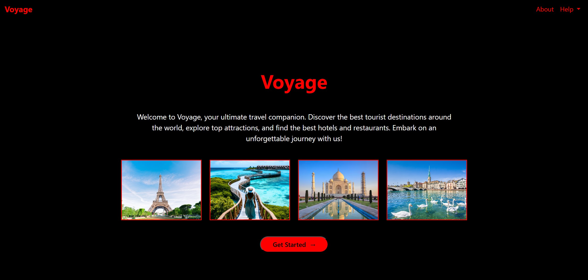
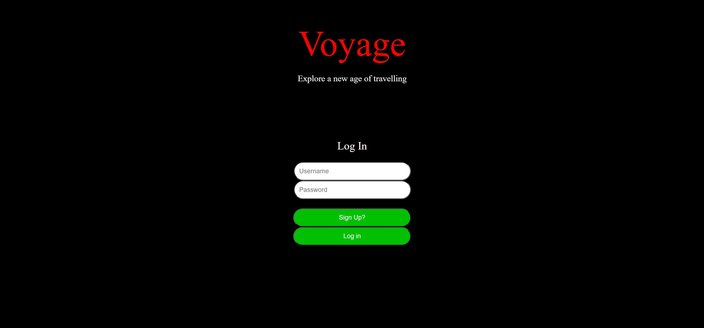
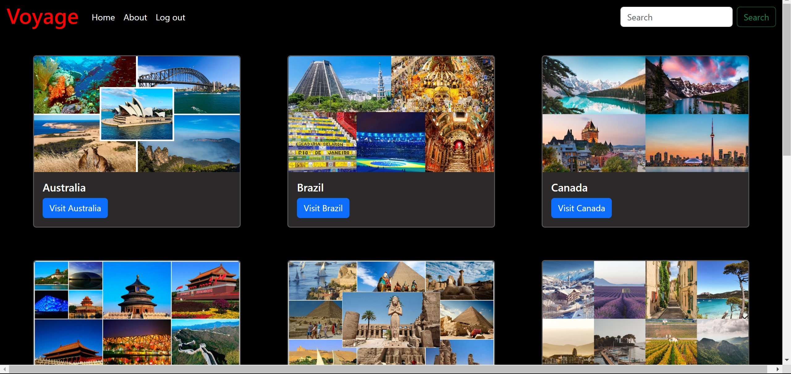
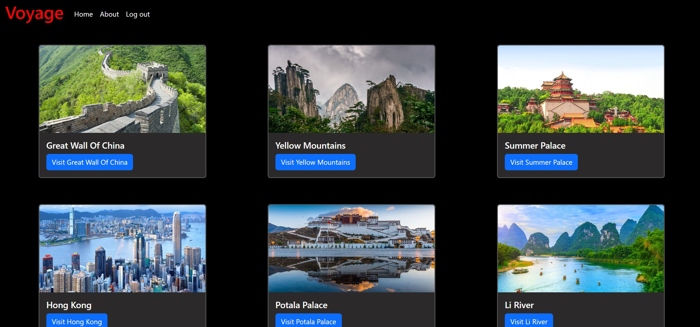
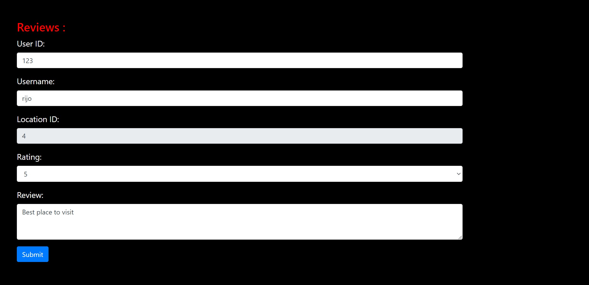

# Voyage 🌏

**Voyage** is a streamlined travel guide for explorers seeking top destinations, city highlights, and travel recommendations worldwide.

## 🌐 Key Features

- **Destination Insights**: Discover famous cities and landmarks across various countries.
- **Interactive City Pages**:
  - **Image Carousel**: A visual tour for each featured city.
  - **Detailed Descriptions**: Essential information about city attractions and highlights.
  - **Reviews**: Add and read reviews from other travelers.
  - **Hotel Recommendations**: Redirects to hotel booking options for each city.

- **User Authentication**: A secure login ensures a personalized experience.

## 🛠️ Tech Stack

- **Frontend**: HTML, CSS, JavaScript
- **Backend**: PHP
- **Database**: SQL (using XAMPP)

## 📸 Screenshots

Explore Voyage’s features with the following screenshots:

1. **Home Page**  
     
   The home page gives users an inviting welcome with options to navigate to various countries and cities. Users are guided towards login for a more customized experience.

2. **Login Page**  
     
   Secure login functionality provides access to city-specific pages and personalized user options.

3. **Country Selection**  
     
   This page showcases a range of countries to explore, each leading to a list of cities with detailed travel information.

4. **City Selection**  
     
   Users can select specific cities within a country, bringing them closer to must-see landmarks, activities, and travel tips for each city.

5. **Image Carousel**  
     
   Each city page includes a visually engaging carousel displaying beautiful images of the city’s most famous spots.

6. **Descriptions and Details**  
     
   Comprehensive descriptions and key details about the city's attractions give users valuable insights into what each place has to offer.

7. **Reviews**  
     
   Users can read reviews from other travelers or contribute their own, sharing experiences and recommendations for future visitors.

8. **Hotel Recommendations**  
     
   Each city page includes hotel recommendations with direct links, making it easy for travelers to book accommodations.

9. **Redirection to Hotel Booking**  
     
   The hotel redirection page provides further details and booking options, connecting users to trusted hotel booking platforms.

## 🚀 Getting Started

1. **Install XAMPP**: Ensure XAMPP is installed on your computer for PHP and SQL support.
2. **Clone this repository**:
   ```bash
   git clone https://github.com/YourUsername/Voyage.git
   ```
3. **Move to htdocs**:
   - Place the `Voyage` folder inside `xampp/htdocs`.
4. **Run on localhost**:
   - Open your browser and go to `http://localhost/Voyage` (or replace `Voyage` with your folder name) to view the project.

## 👥 Contributors

Special thanks to all contributors to this project:

- **Riya Jalan** ([GitHub](https://github.com/Riya-jalan))
- **Ravi N** ([GitHub](https://github.com/Ravinagraj01))

## 🤝 Contributing

Contributions are welcome! Open an issue or submit a pull request to propose changes.

## 📄 License

Licensed under the [Your License Here].

